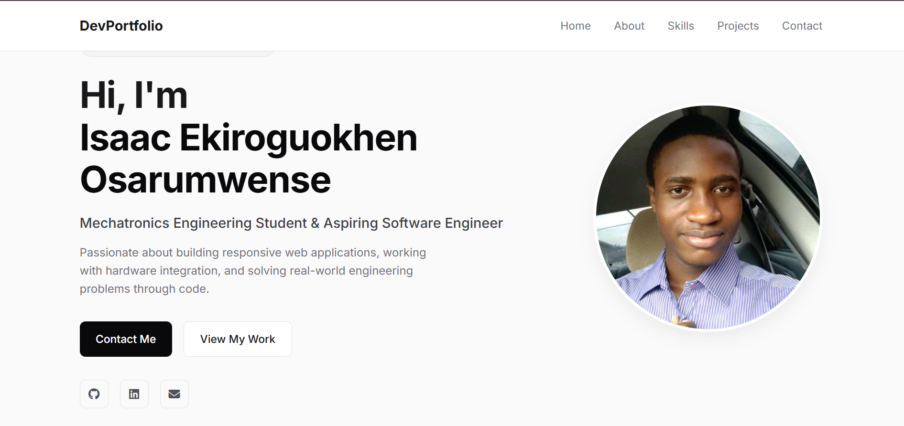

# 🌐 Personal Developer Portfolio

Welcome to my personal portfolio website repository! This project serves as a showcase of my skills, software projects, and background in **Mechatronics Engineering** and **Software Development**.

🚀 **Live Demo:** [Click here to view my portfolio](https://elegonisaac.github.io/my-portfolio/)

---

## 📸 Preview

---

## 🛠️ Tech Stack & Tools

* **Frontend:** HTML5, CSS3 (Flexbox & CSS Grid)
* **Typography & Icons:** Google Fonts (Inter), Font Awesome
* **Deployment & Hosting:** GitHub Pages
* **Version Control:** Git & GitHub

---

## ✨ Features

- **Fully Responsive Layout:** Designed to work smoothly across desktop, tablet, and mobile devices.
- **Clean Aesthetic:** Modern, minimal light-mode interface focused on scannability.
- **Interactive Elements:** Hover animations, direct email links, and dynamic social media links.
- **Structured Sections:** Includes Hero, About Me, Skills Matrix, Featured Projects, and Contact details.

---

## 👤 About the Author

* **Name:** Isaac Ekiroguokhen Osarumwense
* **Field:** Mechatronics Engineering Student
* **Focus:** Full-Stack Web Development, C/C++, Embedded Systems
* **LinkedIn:** [Your LinkedIn Profile](www.linkedin.com/in/isaac-ekiroguokhen)
* **Email:** [your.email@example.com](mailto:elegonisaac@gmail.com)

